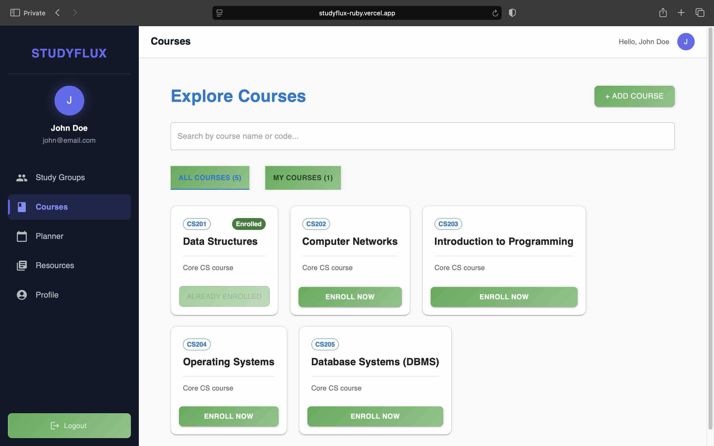
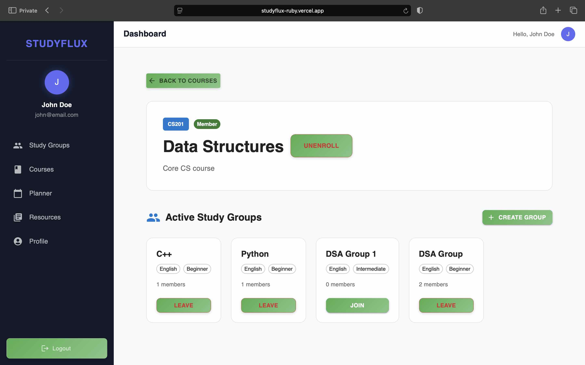
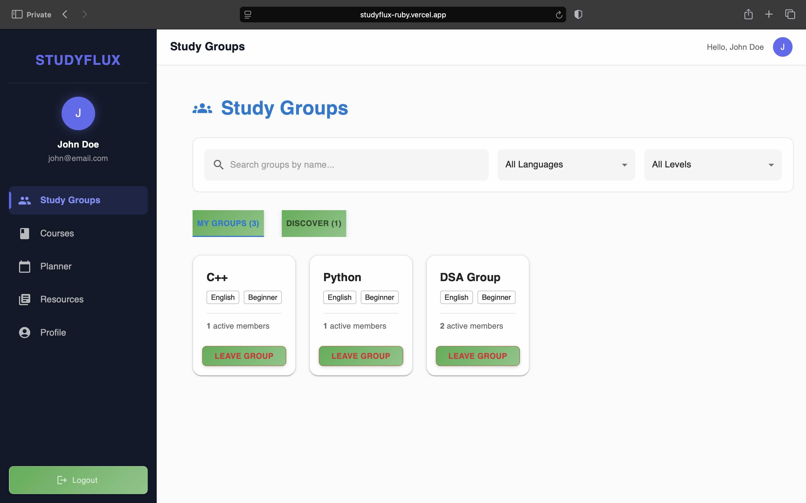
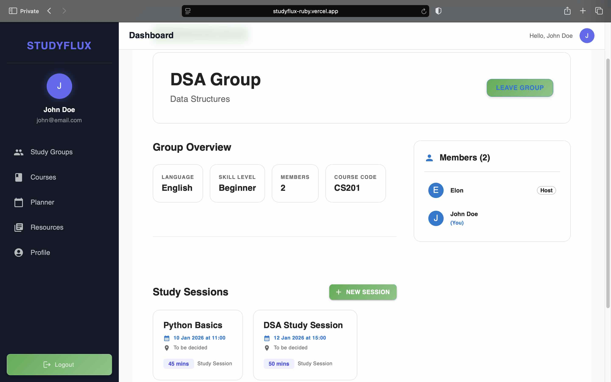
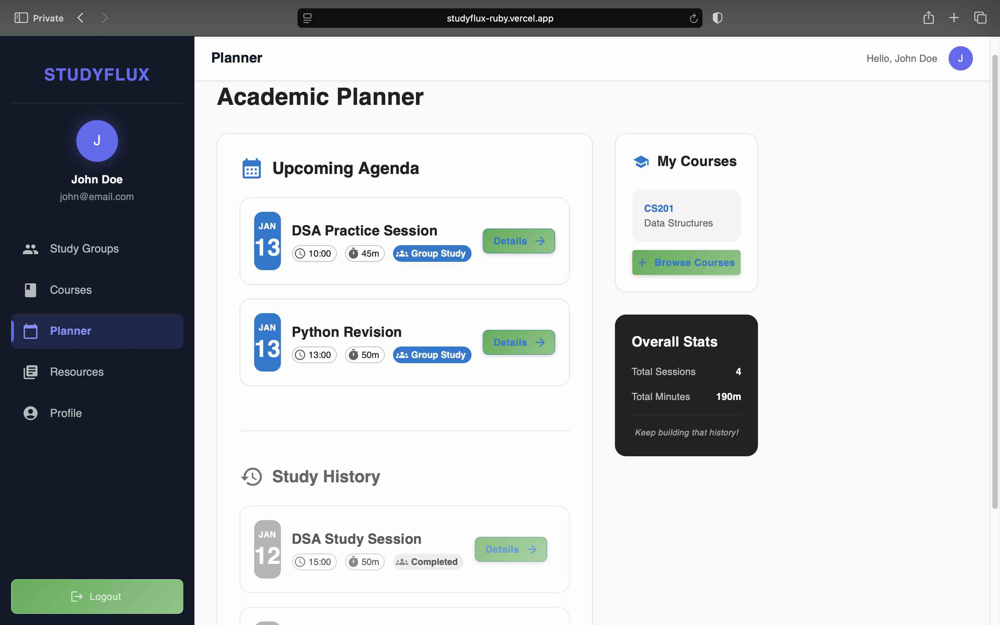
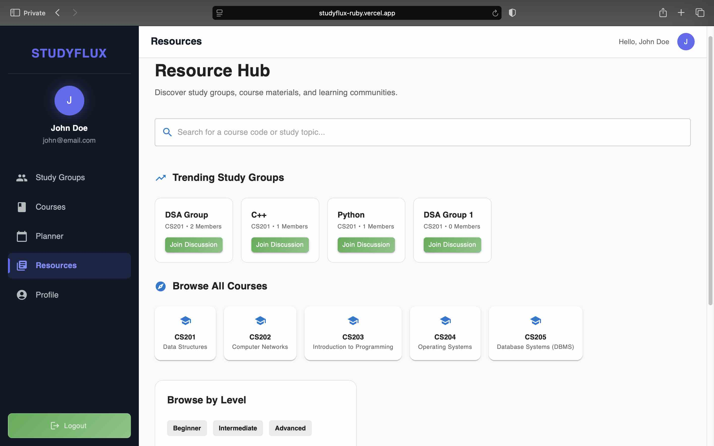
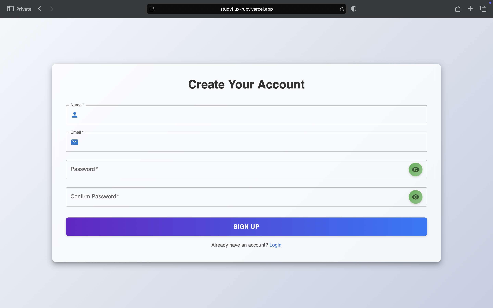
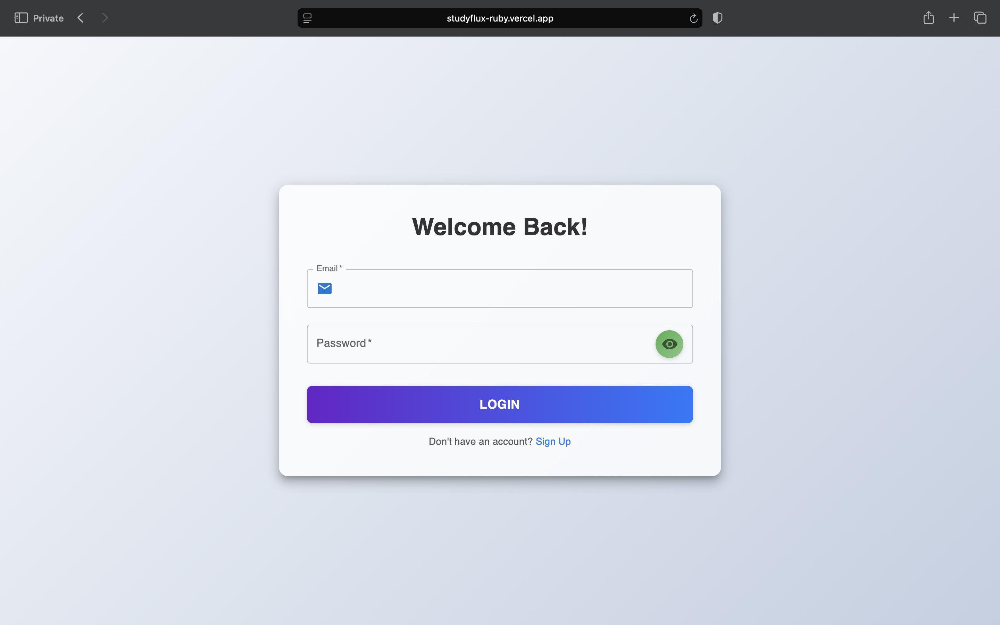
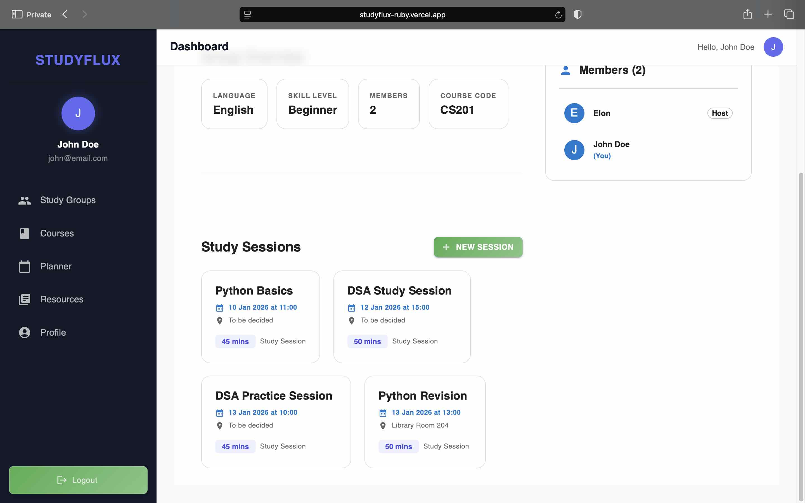
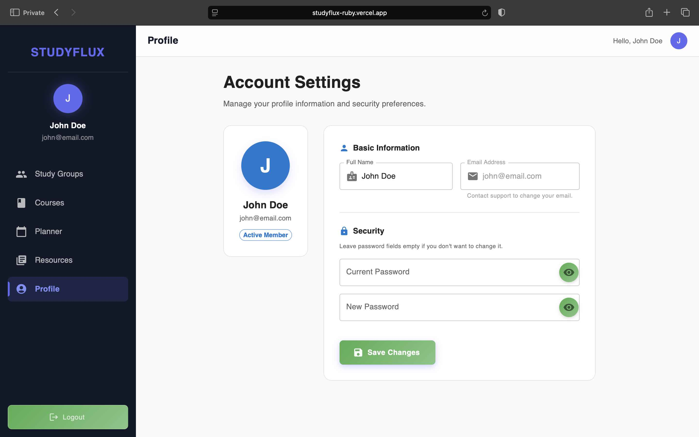

# 🎓 Study Flux

📚 **Study Flux** is a **MERN-based web application** that helps students **find courses**, **enroll**, and **collaborate** through **course-specific study groups** 🤝.  Users can 
**join or create study groups**, **schedule study sessions**, and **track upcoming and past sessions** using a simple **planner** 📅.  By organizing **courses, groups, and 
sessions** in one place, Study Flux supports **structured collaboration** and **consistent study habits** ✨.

---


---

## 📚 Table of Contents

- [🧰 Tech Stack](#-tech-stack)
- [✨ Features](#-features)
- [🎨 UI Highlights](#-ui-highlights)
- [🖼️ Screenshots](#-screenshots)
- [📦 Installation & Setup](#-installation--setup)
- [🚀 Usage](#-usage)
- [🏗 App Structure](#-app-structure)
- [🗂 Key Files](#-key-files)
- [🧩 Core Functionality](#-core-functionality)
- [🔐 Security & Rules](#-security--rules)
- [🧱 System Architecture](#-system-architecture)
- [🔗 Database Schema & Relationships](#-database-schema--relationships)
- [📈 Future Enhancements](#-future-enhancements)
- [❤️ Built With Love](#-built-with-love)

---

## 🧰 Tech Stack

### 🖥️ Frontend

- ⚡ **React 19 (Vite)** – Used for building a fast and interactive user interface.  
- 🎨 **Material-UI (MUI)** – Provides ready-made components for a clean and consistent design.  
- 🛣️ **React Router DOM (v7)** – Handles page navigation smoothly across the app.  
- 📡 **Axios** – Used to communicate with the backend APIs.  
- 🔔 **React Toastify** – Shows real-time notifications for user actions.  

### ⚙️ Backend

- 🟢 **Node.js** – Javascript runtime environment which runs the server-side code and handles requests.  
- 🚀 **Express** – Lightweight framework for building RESTful APIs.  
- 🍃 **MongoDB & Mongoose (ODM)** – Stores app data and provides schema-based data modeling.  
- 🔑 **JWT (JSON Web Token)** – Secure, stateless authentication for user sessions.  
- 🛡️ **Bcryptjs** – Hashes passwords for secure user authentication.

---

## ✨ Features

- 🔒 **Enrollment-Gated Access** – Study groups are private communities. You can only view and participate if you are officially enrolled in the parent course.  
- 🧹 **Smart Cascade Delete** – Keeps the database clean. If a user deletes a Study Group, all related Study Sessions are automatically removed.  
- 📊 **Motivation Dashboard** – The Planner shows your study history and calculates total study hours to help gamify your learning.  
- 🔍 **Advanced Discovery** – The Resources page highlights trending courses based on member count and supports full-text search with filters.  
- 📱 **Persistent Navigation** – A unified Sidebar keeps Planner, Profile, and Resources just one click away across the app.  

- 🔐 **Authentication** – Signup & Login with JWT for secure access.  
- 📘 **Courses** – Browse, enroll, and create courses.  
- 👥 **Study Groups** – Join, create, and leave course-specific study groups.  
- 📅 **Study Sessions** – Schedule, track, and manage study sessions.  
- 🧭 **Planner** – View upcoming agenda, study history, and overall stats.  
- 🔍 **Resources** – Search and filter trending courses efficiently.  
- 👤 **Profile** – Update your name and password easily.

---

## 🎨 UI Highlights

- ✨ **Clean Design** – Built with Material-UI for a modern and consistent look.  
- 📱 **Responsive Layout** – Works smoothly on desktops, tablets, and mobile devices.  
- 🔔 **Toast Notifications** – Real-time alerts for user actions and feedback.  
- 🧭 **Intuitive Navigation** – Easy-to-use Sidebar and menu for seamless app navigation.  

---

## 🖼 Screenshots

### Courses Page
<div align="center">
  
</div>

### Course Details Page
<div align="center">
  
</div>

### Study Groups Page
<div align="center">
  
</div>

### Study Group Details Page
<div align="center">
  
</div>

### Planner Page
<div align="center">
  
</div>

### Resources Page
<div align="center">
  
</div>

### Signup Page
<div align="center">
  
</div>

### Login Page
<div align="center">
  
</div>

### Study Sessions Page
<div align="center">
  
</div>

### Profile Page
<div align="center">
  
</div>

---

## 📦 Installation & Setup

To get started with **Study Flux**, follow these steps:

### 1. Clone the repository

   ```bash
   git clone https://github.com/sandeepmukku12/study_flux.git
   cd study_flux
   ```

### 2. Backend Setup
   
   Navigate to the server directory and install dependencies:

   ```bash
   cd server
   npm install
   ```
   Create a `.env` file in the `server` directory:

   ```env
   PORT=5000
   MONGODB_URI=your_mongodb_connection_string
   JWT_SECRET=your_super_secret_key
   ```
   Run the server:

   ```bash
   npm start
   ```

### 3. Frontend Setup

   Navigate to the client directory and install dependencies:

   ```bash
   cd client
   npm install
   ```
   Create a `.env` file in the `client` directory:

   ```env
   VITE_API_URL=http://localhost:8082/api
   ```

   Start the Vite development server:

   ```bash
   npm run dev
   ```

### ✅ Notes

- After running the frontend, open your browser at [http://localhost:5173](http://localhost:5173) (Vite default) to access the app.  
- Make sure the backend server is running before using the frontend.

---

## 🚀 Usage

To get the most out of **Study Flux**, follow this typical user flow:

- **Authentication** – Start by creating an account on the Signup page. Once logged in, you'll be directed to the main dashboard.  
- **Course Enrollment** – Navigate to the **Courses** menu via the sidebar. Browse the available catalog or create your own course. Click on a course card to view details and hit **Enroll**.  
- **Joining Groups** – After enrolling, the course detail page will show associated **Study Groups**. You can join an existing group or create a new one for that course.  
- **Collaboration** – Inside a Study Group, view the member list and check upcoming **Study Sessions**. If you are a group member, you can schedule new sessions.  
- **Planning & Stats** – Use the **Planner** to view your schedule. The "Overall Stats" section automatically updates your total study duration and session count to help track your consistency.
- **Resources** - Use the **Resources** to view the most trending groups, filter courses and more.
- **Profile** - Use the **Profile** to update your profile.

---

## 🏗 App Structure

```bash
study-flux/
│
├─ client/ # Frontend built with React + Vite
│ ├─ public/ # Static assets (images, icons, etc.)
│ ├─ src/
│ │ ├─ components/ # Reusable React components
| | ├─ dashboard/ # Dashboard layout
│ │ ├─ pages/ # Page components (Login, Signup, Courses, Study Groups, Planner, Profile, Resources)
│ │ ├─ api/ # API calls using Axios
│ │ └─ context/ # React context for global state (auth)
│ └─ .env # Environment variables (VITE_APP_URL)
|
├─ server/ # Backend built with Node.js + Express
│ ├─ controllers/ # Handles incoming requests
│ ├─ models/ # Mongoose schemas
│ ├─ routes/ # API route definitions
│ ├─ services/ # Business logic for controllers
│ ├─ middleware/ # Authentication & error handling
| └─ .env # Environment variables (PORT, DB URI, JWT secret)
│
└─ README.md # Project documentation
```

---

## 🗂 Key Files

Here are the important files in the Study Flux project and their purposes:

### 🖥️ Frontend (`client/`)
- `src/App.jsx` – Main React component that wraps all pages and routes.  
- `src/main.jsx` – Entry point for the React + Vite app.  
- `src/components/` – Reusable UI components like buttons, cards, and modals.  
- `src/pages/` – Individual pages (Dashboard, Courses, Study Groups, Planner, Profile, Resources).    
- `src/api/` – Handles API calls to the backend using Axios.  
- `src/context/` – Global state management for auth.  

### ⚙️ Backend (`server/`)
- `index.js` – Entry point for the Express backend server and MongoDB connection setup.  
- `.env` – Stores environment variables like `PORT`, `MONGODB_URI`, and `JWT_SECRET`.  .  
- `controllers/` – Handle incoming requests and interact with services.  
  - `auth.controller.js` – Signup/Login endpoints.  
  - `user.controller.js` – Profile endpoints.  
  - `course.controller.js` – Course CRUD and enrollment logic.  
  - `studyGroup.controller.js` – Study group CRUD, join/leave, search.  
  - `studySession.controller.js` – Study session scheduling and retrieval.  
- `models/` – Mongoose schemas for Users, Courses, StudyGroups, and StudySessions.  
- `routes/` – API endpoint definitions.  
- `services/` – Business logic separate from controllers.  
- `middleware/` – JWT authentication and centralized error handling.

### 🏠 Root Files
- `README.md` – Project documentation.  
- `.env` – Environment variables for backend configuration.

---

## 🧩 Core Functionality

### 🔐 Authentication
- User signup and login using JWT  
- Protected routes across the application  


### 📘 Courses
- View all available courses  
- Create your own courses  
- Enroll in courses  
- Course details page includes:
  - Course information  
  - Related study groups  
  - Study group access only for enrolled users  


### 👥 Study Groups
- View study groups under:
  - **My Groups**
  - **Discover Groups**
- Join and leave study groups  
- Create course-specific study groups  
- Study group details page includes:
  - Members list  
  - Study sessions list  
  - Create and delete sessions (creator only)  
  - Leave group  
  - Delete group (creator only)  

⚠️ **Cascade Delete**  
Deleting a study group automatically removes all related study sessions.


### 📅 Study Sessions
- Create sessions within study groups  
- Track session details:
  - Topic  
  - Date & time  
  - Duration  
- Delete sessions (creator only)  


### 🧭 Planner
- 📌 **Upcoming Agenda** – View future study sessions  
- 📜 **Study History** – View past sessions  
- 📊 **Overall Stats**:
  - Total sessions attended  
  - Total study duration  

Designed to improve **motivation and consistency** 💪


### 🔍 Resources
- View trending courses based on member count  
- Search courses  
- Filter courses easily  


### 👤 Profile
- Update user name  
- Change password securely  


### 🧭 Navigation (Sidebar)
The sidebar is persistent across all pages and includes:
- 📘 Courses  
- 👥 Study Groups  
- 📅 Planner  
- 📚 Resources  
- 👤 Profile  

---

## 🔐 Security & Rules

- 🔄 **Cascade Deletion**: When a study group is deleted, all related study sessions are automatically removed from the database.  
- 🔒 **Protected Routes**: Both frontend routes and backend controllers are secured with JWT authentication.
- 👤 **Ownership Verification**: Users can only modify or delete content that they created, ensuring proper access control.

---

## 🧱 System Architecture

The application follows a classic **client-server architecture**. The React frontend communicates with the Node.js/Express backend via a **RESTful API**, secured using **JWT authentication**.

---

## 🔗 Database Schema & Relationships

### Schema

- **User**: name, email, password, enrolled courses
- **Course**: name, code, description
- **StudyGroup**: name, course reference, members, creator
- **StudySession**: topic, date/time, duration, group reference, creator

Study Flux uses a relational approach within MongoDB to handle the complex dependencies between users, courses, and collaborative sessions.

### Logic Highlights

- 🔁 **User ↔ Course** – Many-to-Many relationship to support course enrollment.  
- 📘 **Course ↔ Study Group** – One-to-Many relationship where each course can have multiple study groups.  
- 📅 **Study Group ↔ Study Session** – One-to-Many relationship with cascade delete logic for automatic cleanup.  
- 👤 **Ownership Rules** – Both `StudyGroup` and `StudySession` store a `creator` field to enforce permission-based actions.

---

## 📈 Future Enhancements

- 🔔 **Session Reminders & Notifications**  
- 💬 **Group Chat**  
- ⭐ **Course & Study Group Ratings**  
- 📊 **Advanced Analytics Dashboard**  

---

## 📄 License

This project is licensed under the **MIT License**. See the LICENSE file for more info.

---

## ❤️ Built With Love

**Study Flux** was built with ❤️ by **Sandeep Mukku**  
It’s designed to help students **collaborate**, **organize**, and **track their learning** in one simple and intuitive platform.  

Thank you for checking out the project! 🙌

---
